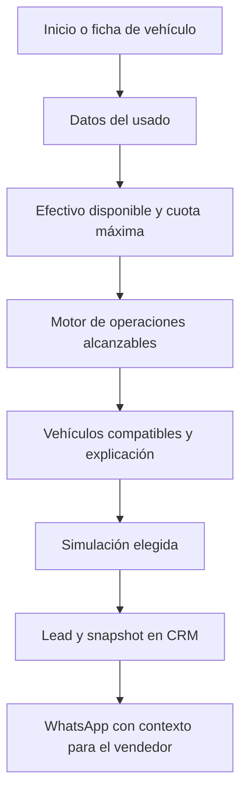
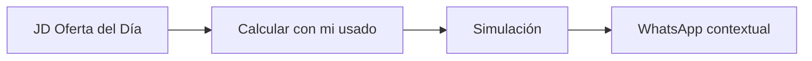
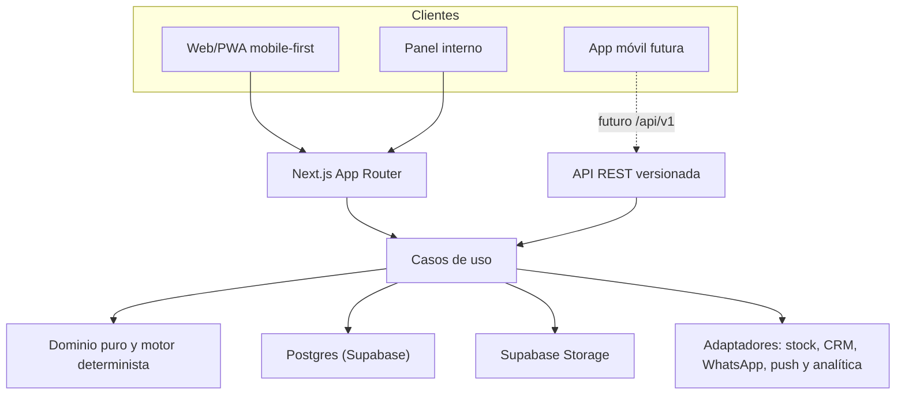

# Jesús Díaz Automotores — Plan maestro V1

## 1. Estado del alcance

Este documento congela la primera versión del producto como una web/PWA mobile-first. La futura app móvil consumirá el mismo backend y reutilizará contratos y lógica de negocio, pero no forma parte de la V1.

La propuesta de valor es:

> Jesús Díaz Automotores no muestra solamente autos: ayuda a descubrir qué vehículo te podés llevar hoy y cómo sería aproximadamente la operación.

La V1 contiene únicamente seis capacidades:

| Capacidad | Función dentro del producto |
|---|---|
| Stock real | Base de vehículos efectivamente disponibles |
| Tasación preliminar | Estimación o revisión del usado que se entrega |
| ¿Qué auto te podés llevar hoy? | Motor central de accesibilidad económica |
| Simulador de operación | Desglose comprensible de usado, efectivo, saldo y cuotas |
| WhatsApp + CRM con contexto | Entrega de un lead calificado al vendedor |
| JD Oferta del Día | Acelerador de tráfico, urgencia y rotación de stock |

Todo lo demás queda fuera de V1: JD Scan con IA, Mi Garage, JD Passport, realidad aumentada, vista 360°, negociador con IA, chatbot generalista, recomendaciones con IA, automatización comercial avanzada y login de clientes complejo.

La cuenta del cliente se sumó después como capacidad **opcional** y acotada
(alta con correo y contraseña, preferencias, favoritos, búsquedas guardadas y
seguimiento de lo ya consultado). No contradice la exclusión de arriba ni la
regla del punto 8 de la lista de verificación: el flujo principal sigue
funcionando sin login. Su estado y lo que falta están en
[PUERTAS_DE_SALIDA.md](PUERTAS_DE_SALIDA.md).

**Consignación virtual (V1.1, opcional):** existe implementada y endurecida
([PLAN_CONSIGNACION_VIRTUAL.md](PLAN_CONSIGNACION_VIRTUAL.md)), pero no forma
parte de la V1: no se navega ni se anuncia hasta que JDA apruebe comisión,
contrato y retiro de unidad. Las decisiones pendientes viven en
[DECISIONES_JDA.md](DECISIONES_JDA.md).

**CRM unificado y asesor conversacional (puente Zernio, V1.1, opcional):**
esto sí toca la exclusión de arriba —el asesor es, en los hechos, un
negociador con IA por WhatsApp, no sólo "WhatsApp + CRM con contexto"—. Se
construyó explícitamente por pedido posterior, con la misma disciplina que el
resto del sistema: la IA no calcula ni recuerda precios, no elige stock, y
toda cifra que envía sale de una llamada real al motor y queda congelada en
una simulación citable. El plan completo, sus fases y sus prerrequisitos
—cuenta Zernio conectada, número de WhatsApp confirmado, plantillas
aprobadas, tarifario real— están en
[PLAN_CRM_ZERNIO.md](PLAN_CRM_ZERNIO.md). Como con consignación, ninguna
conversación real pasa por acá hasta que esos prerrequisitos estén resueltos:
mientras falten, el asesor sólo corre contra la base DEMO.

---

## 2. Datos del negocio

| Dato | Valor inicial |
|---|---|
| Nombre | Jesús Díaz Automotores |
| Ciudad | Tandil |
| Dirección | Piedrabuena esq. Rauch |
| Teléfono informado | 2494587046 |
| Zona horaria | America/Argentina/Buenos_Aires |
| Moneda e idioma | ARS / es-AR |

Antes de publicar se debe confirmar el formato internacional del número que recibirá mensajes de WhatsApp. El valor probable es `+54 9 249 458-7046`, pero no se debe hardcodear sin validación del negocio.

También quedan pendientes el dominio, los horarios, las redes sociales, el logo, la paleta de marca y el enlace exacto de ubicación.

---

## 3. Recorrido principal



Recorrido alternativo:



Principios del recorrido:

- No se exige nombre ni teléfono para explorar o simular.
- Nombre, WhatsApp y consentimiento se solicitan al enviar la operación.
- Ningún resultado significa crédito aprobado ni tasación definitiva.
- La interfaz siempre explica de dónde sale cada monto.
- Un cambio de precio, stock u oferta obliga a recalcular antes del contacto.

---

## 4. Arquitectura elegida

Se construirá un monolito modular TypeScript. No habrá microservicios en V1.



Decisiones:

- Next.js App Router y TypeScript estricto para web, panel y API.
- Node.js como runtime del servidor.
- Postgres en Supabase como fuente de verdad interna para la V1 (migrado desde
  Cloudflare D1 el 4 de septiembre de 2026, por decisión del usuario).
- Supabase Storage como almacenamiento de imágenes y archivos (migrado desde
  Cloudflare R2 el 5 de septiembre de 2026, por decisión del usuario).
- GitHub `bajo3/JD-APP` → Vercel como único flujo de publicación; Next.js 16
  usa Supabase por conexión Postgres directa y Supabase Storage privado por
  S3. Sites/Vinext
  fueron retirados del runtime por decisión del usuario; las puertas están en
  `MIGRACION_VERCEL.md`.
- Tailwind CSS y componentes accesibles para la interfaz.
- Zod para contratos y validación compartida.
- Drizzle ORM y migraciones SQL explícitas.
- API reusable y contratos versionados para la futura app Expo/React Native; no se requiere un monorepo móvil en la V1.
- Vitest para pruebas unitarias y de dominio; Playwright para recorridos completos.
- Proveedor de errores y analítica detrás de adaptadores, para evitar acoplamiento.

Las versiones exactas se fijarán al iniciar el proyecto usando versiones estables y soportadas en ese momento.

Next.js se usará de esta manera:

- Los Server Components leen directamente desde servicios/repositorios, sin llamarse a sí mismos por HTTP.
- Las mutaciones de la web usan Server Actions que invocan los mismos casos de uso.
- `/api/v1` expone contratos para integraciones y la futura app móvil.
- Los webhooks externos se implementan como Route Handlers.

### Estructura del repositorio

```text
apps/
  web/
    src/app/
      (public)/
      panel/
      api/v1/
    src/features/
packages/
  domain/          # Entidades, dinero, reglas y motor determinista
  application/     # Casos de uso y puertos
  contracts/       # Esquemas, DTO, errores y OpenAPI
  database/        # Drizzle, repositorios y migraciones
  api-client/      # Cliente tipado para la futura app
  design-tokens/   # Colores, tipografía y espaciado
  observability/   # Logs, métricas y errores
  test-fixtures/   # Escenarios dorados y datos de prueba
```

Cuando se decida crear la app:

```text
apps/mobile/       # Expo/React Native
```

Se compartirán dominio, contratos, cliente API, formateadores y design tokens. No se intentará compartir componentes visuales web con React Native.

---

## 5. Mapa de navegación mobile-first

### Navegación pública

En móvil hay una barra inferior con cuatro accesos:

1. Inicio.
2. Stock.
3. ¿Qué me llevo? (etiquetado "Ayuda").
4. Contacto/WhatsApp: abre el chat cuando el número está confirmado y cae a
   `/contacto` si no lo está.

En escritorio se convierte en un encabezado horizontal. El CTA de contacto
permanece visible; la Oferta JD se alcanza desde la portada y su propia ruta.

| Ruta | Objetivo y contenido principal |
|---|---|
| `/` | Propuesta central, formulario corto, oferta vigente, destacados y contacto |
| `/stock` | Catálogo, filtros, orden, disponibilidad y cards |
| `/autos/[slug]` | Galería, datos, precio, oferta, disponibilidad y CTA de operación |
| `/tasar-mi-usado` | Formulario por pasos y carga de fotos |
| `/que-auto-me-llevo` | Entradas económicas, resultados y explicación de alcance |
| `/simulaciones/[codigo]` | Snapshot de la operación elegida |
| `/oferta-del-dia` | Beneficio vigente, condiciones y cuenta regresiva |
| `/contacto` | WhatsApp, teléfono, dirección y mapa |

### Panel interno

Una sola aplicación interna evita duplicar paneles. En la V1 el acceso usa una
única allowlist de administradores (`PANEL_ALLOWED_EMAILS`): todos los correos
habilitados operan todo el panel y cada acción sensible queda auditada por
actor. Los roles por función (`ADMIN`, `SELLER`, `APPRAISER`, `MARKETING`)
quedan para una versión posterior si el equipo crece; la decisión está
registrada en [DECISIONES_JDA.md](DECISIONES_JDA.md) (#8).

| Ruta | Función |
|---|---|
| `/panel` | Resumen del negocio calculado desde registros operativos |
| `/panel/leads` | Pipeline, contexto y seguimiento |
| `/panel/leads/[id]` | Snapshot, notas, WhatsApp y estado |
| `/panel/stock` | Unidades y disponibilidad |
| `/panel/tasaciones` | Revisiones, rangos y vigencia |
| `/panel/tasaciones/[id]` | Revisión de una tasación con sus fotos privadas |
| `/panel/financiacion` | Planes, tasas, gastos y versiones |
| `/panel/ofertas` | Programar y pausar promociones |
| `/panel/consignaciones` | Consignaciones V1.1 en revisión |

La autorización se valida en cada caso de uso, no solo ocultando botones, y
falla cerrado cuando la allowlist no está configurada.

---

## 6. Especificación de las seis capacidades

### 6.1 Stock real

Datos mínimos de una unidad:

- ID único, slug y código externo.
- Marca, modelo, versión, año y kilómetros.
- Precio, moneda, vigencia y fecha de actualización.
- Tipo de vehículo, combustible, transmisión y color.
- Fotos ordenadas.
- Estado y observaciones internas.
- Fuente y fecha de última sincronización.

Estados principales:

```text
DRAFT → AVAILABLE → HELD → RESERVED → SALE_PENDING → SOLD
             ↑          ↓
             └──────────┘
```

También existen `BLOCKED`, `IN_SERVICE`, `INACTIVE` y `ARCHIVED`.

Reglas:

- Solo `AVAILABLE` aparece como disponible hoy.
- Si la sincronización está vencida, se muestra “consultar disponibilidad”.
- Una unidad reservada o vendida no entra en resultados nuevos.
- Los cambios de precio conservan historial.
- La fuente de verdad debe definirse antes de integrar: DMS, sistema actual, panel o planilla transitoria.

### 6.2 Tasación preliminar

Formulario por pasos:

1. Marca, modelo, versión, año y kilómetros.
2. Estado declarado, reparaciones, documentación y posibles deudas/prenda.
3. Fotos de frente, atrás, laterales, interior y tablero.
4. Nombre, WhatsApp y consentimiento solo al enviar.

Niveles de certeza:

| Nivel | Evidencia | Resultado permitido |
|---|---|---|
| T0 | Datos mínimos declarados | Rango orientativo amplio |
| T1 | Versión, km, estado y fotos | Estimación preliminar |
| T2 | Revisión remota del tasador | Pre-tasación revisada |
| T3 | Inspección física y documentación | Tasación comercial validada |
| T4 | Aceptación formal vigente | Valor operativo de cierre |

V1 trabaja con T0–T2 en la web. T3–T4 pertenecen al proceso humano.

La tasación utiliza tres escenarios: conservador (`T_low`), probable (`T_base`) y favorable (`T_high`). Cada ajuste conserva motivo, fuente, vigencia y versión de reglas. Si JDA no tiene datos reales suficientes, la V1 entrega el caso a revisión humana en lugar de inventar un valor automático.

### 6.3 ¿Qué auto te podés llevar hoy?

Entrada mínima:

- Tasación o rango preliminar del usado, si existe.
- Efectivo disponible.
- Cuota máxima.
- Plazos aceptados.
- Preferencias opcionales.

Ecuación por unidad y escenario:

```text
precio efectivo = precio vigente - descuento aplicable

costo de operación =
  precio efectivo
  + gastos financiables
  + gastos no financiables

aporte del cliente =
  tasación aplicable
  + bonificación especial de toma
  + efectivo disponible
  + seña acreditable

saldo a financiar = max(0, costo de operación - aporte del cliente)
```

El plan debe cumplir simultáneamente:

- Monto mínimo y máximo financiable.
- Porcentaje máximo financiable.
- Anticipo mínimo.
- Gastos no financiables cubiertos.
- Antigüedad y tipo de vehículo admitidos.
- Precio, plan y oferta vigentes.
- Cuota estimada menor o igual al máximo declarado.

Clasificación:

| Estado | Regla resumida |
|---|---|
| Alcanzable con margen | Funciona con tasación conservadora y margen de cuota |
| Alcanzable estimado | Funciona con tasación probable |
| Cerca de alcanzarlo | Requiere escenario favorable o un pequeño ajuste |
| Requiere evaluación | Faltan datos confiables |
| No alcanzable hoy | Ningún plan vigente cumple las restricciones |

Primero se aplican restricciones duras; luego se ordena por certeza, preferencias, margen de cuota, proporción financiada, frescura de datos y oferta vigente. Una prioridad comercial nunca puede volver válida una operación inválida.

La función de dominio debe ser determinista:

```text
evaluateOperation(input, ruleset, snapshot) -> evaluation
```

El resultado incluye siempre desglose, razones, supuestos, certeza y vigencia.

### 6.4 Simulador de operación

Una simulación es un snapshot inmutable y auditable:

- Vehículo y precio consultado.
- Oferta aplicada.
- Tasación y nivel de certeza.
- Efectivo.
- Gastos financiables y no financiables.
- Saldo.
- Plan, plazo, cuota y costo total disponibles.
- Versión del motor y de las reglas.
- Fecha de creación y vencimiento.

Las condiciones financieras se cargan como versiones con vigencia. El cotizador debe admitir fórmula francesa, coeficiente por monto o tabla entregada por el proveedor. Los cálculos monetarios usan decimal fijo, nunca coma flotante.

La UI muestra:

> Simulación preliminar sujeta a inspección del usado, verificación documental, disponibilidad de la unidad y aprobación crediticia.

No usa “aprobado”, “garantizado” ni “tasación final”.

### 6.5 WhatsApp + CRM con contexto

Flujo:

1. Se crea o actualiza el lead.
2. Se guarda interés, consentimiento y snapshot de simulación.
3. Se genera un código de operación corto.
4. Se crea el handoff de WhatsApp.
5. Se registra la apertura y se alerta al vendedor.

Mensaje sugerido:

```text
Hola, me interesa la T-Cross 2022.
Mi operación JD: JD-8F3K2
```

El CRM interno conserva el detalle completo:

- Vehículo y oferta.
- Usado y rango de tasación.
- Efectivo y cuota máxima.
- Plan elegido.
- Desglose y vigencia.
- Origen del lead.
- Consentimientos.

La V1 puede empezar con click-to-chat mediante `wa.me`. Los mensajes salientes automáticos requieren WhatsApp Business Platform, plantillas aprobadas y consentimiento independiente.

Estados del lead:

```text
NEW → CONTACTED → NEGOTIATING → WON
  └──────────────→ LOST
```

### 6.6 JD Oferta del Día

Tipos:

- Descuento de precio.
- Financiación especial.
- Bonificación adicional por usado.
- Fin de Semana JD.
- Última Unidad.

Estados:

```text
DRAFT → SCHEDULED → ACTIVE → EXPIRED
               ├──→ PAUSED
               └──→ CANCELLED
```

Reglas:

- Inicio y fin se guardan en UTC y se presentan con hora de Buenos Aires.
- El precio o condición normal se congela como snapshot al publicar.
- El reloj del servidor decide la vigencia; la cuenta regresiva es solamente visual.
- Un beneficio no se acumula con otro salvo autorización explícita.
- La bonificación por usado se muestra separada de la tasación.
- Si la unidad deja de estar disponible, la oferta se pausa o usa un reemplazo aprobado.
- El motor recalcula automáticamente el alcance usando el beneficio vigente.
- Las aperturas repetidas y los clics se registran como señales explicables, sin IA.

La reserva con seña queda preparada en el modelo, pero fuera del primer corte salvo confirmación del negocio sobre pago, devolución, conciliación y términos legales.

---

## 7. Modelo de datos esencial

| Entidad | Responsabilidad |
|---|---|
| `business_profile` | Nombre, teléfono, dirección, zona y configuración |
| `vehicle` | Unidad física, atributos, precio, estado y versión |
| `vehicle_media` | Fotos públicas y orden |
| `vehicle_price_history` | Historial inmutable de precios |
| `external_stock_mapping` | Relación con la fuente de stock |
| `stock_sync_run` | Resultado y frescura de sincronizaciones |
| `appraisal` | Datos, rango, estado, reglas y vigencia |
| `appraisal_media` | Fotos privadas del usado |
| `appraisal_rule_set` | Reglas versionadas de tasación |
| `finance_plan_version` | Tarifario publicado y vigencia |
| `finance_plan_tier` | Plazo, tasa, montos y gastos |
| `simulation` | Snapshot completo de la operación |
| `promotion` | Tipo, beneficio, vigencia y estado |
| `promotion_vehicle` | Unidades incluidas en la promoción |
| `lead` | Identidad y estado comercial |
| `lead_interest` | Vehículo, simulación, tasación u oferta asociada |
| `lead_event` | Eventos del embudo e intención explicable, incluidos los handoffs de WhatsApp con su código de operación |
| `consent` | Canal, propósito, fecha y revocación |
| `admin_idempotency` | Replays y conflictos de las mutaciones del panel |
| `admin_audit_log` | Cambios comerciales sensibles con actor |

`push_subscription` (push nativo) y `outbox_event` (entrega a CRM externo)
quedan para después de la V1, cuando exista un proveedor confirmado.

Reglas de persistencia:

- Dinero como `numeric(18,2)`/Decimal.
- Fechas como `timestamptz`.
- IDs internos UUID y slugs/códigos públicos separados.
- Columna de versión para concurrencia optimista.
- Historial en lugar de sobrescritura destructiva.
- Fotos de tasaciones en almacenamiento privado.
- No se diseña multi-tenant: es una sola concesionaria.

---

## 8. Contratos API V1

### Públicos y futura app (implementadas en la V1)

```text
GET    /api/v1/vehicles
GET    /api/v1/vehicles/{slug}
GET    /api/v1/promotions/current
GET    /api/v1/offers/current
GET    /api/v1/business-profile
GET    /api/v1/media/vehicles/{mediaId}
GET    /api/v1/simulations/{code}
POST   /api/v1/affordability/search
POST   /api/v1/simulations
POST   /api/v1/appraisals
POST   /api/v1/appraisals/{code}/photos
POST   /api/v1/leads
POST   /api/v1/whatsapp/handoffs
```

Las mutaciones públicas pasan por el limitador de abuso por IP y ventana fija
persistido en Supabase, que responde 429 estable con `Retry-After`. La consignación
V1.1 agrega `POST /api/v1/consignments` y `POST /api/v1/consignments/{code}/photos`,
sin navegación pública.

### Panel interno

```text
/api/v1/admin/overview
/api/v1/admin/vehicles        (+ media por unidad)
/api/v1/admin/finance-plans
/api/v1/admin/promotions
/api/v1/admin/leads
/api/v1/admin/appraisals      (+ fotos privadas)
/api/v1/admin/consignments    (V1.1)
```

Todas autorizan contra la allowlist antes de leer o escribir, con idempotencia,
control de versión y auditoría por actor.

### Posteriores a la V1

Push (`/api/v1/push/*`), webhooks de stock/CRM/WhatsApp y el job de outbox no
forman parte de la V1: se agregan cuando exista un proveedor confirmado. La
entrega del lead en la V1 es click-to-chat y el seguimiento vive en el panel.

Reglas transversales:

- Validación de entrada con contratos compartidos.
- Errores con códigos de negocio estables.
- Paginación por cursor.
- `Idempotency-Key` en tasaciones, leads, reservas y webhooks.
- Firma y deduplicación de webhooks.
- No incluir información personal o interna en errores.
- Documentar los contratos con OpenAPI.

Puertos de integración:

```text
StockProvider
AppraisalMediaStore
FinanceQuoteProvider
CrmSink
WhatsAppGateway
PushGateway
AnalyticsPort
```

Implementaciones iniciales:

- Stock: panel o importación CSV hasta conocer el sistema actual.
- CRM: módulo interno y adaptador externo posterior.
- WhatsApp: click-to-chat y API Business posterior.
- Financiación: tarifario manual versionado; API del proveedor después.

Los eventos hacia proveedores externos pasarán por una outbox con reintentos e
idempotencia para no perder leads cuando un proveedor esté caído; en la V1 no
hay proveedores externos y el circuito no se expone.

---

## 9. Mobile-first y PWA

Criterios obligatorios:

- Diseño base desde 320 px.
- Áreas táctiles de al menos 44 px.
- Sin funciones dependientes de hover.
- CTA inferior fijo en fichas y simulaciones.
- Formularios cortos y divididos en pasos.
- `inputMode` adecuado para teléfono, dinero y kilómetros.
- Galerías táctiles y fotos responsivas.
- Estados de carga, vacío, error, vencido, offline y stock cambiado.
- Accesibilidad WCAG 2.2 AA.
- Objetivo inicial de LCP móvil p75 menor a 2,5 segundos.

PWA:

- Manifest, iconos, tema, `display: standalone` y HTTPS.
- Service worker y pantalla offline.
- Cache de assets, imágenes y fichas consultadas recientemente.
- No tratar como verdad offline el stock, el precio, una oferta o una financiación.
- Mostrar siempre “última actualización”.
- Banner sin conexión.
- Push nativo posterior a la V1: cuando exista, se solicitará después de una
  acción de interés, nunca al entrar.

Estados mínimos de cada pantalla:

- Skeleton de carga.
- Sin datos.
- Error recuperable.
- Validación de formulario.
- Sesión o dato vencido.
- Stock u oferta modificados.
- Confirmación exitosa.

---

## 10. Seguridad, privacidad y auditoría

- Sin cuenta obligatoria para clientes en V1.
- Sesión anónima en cookie firmada, segura y HttpOnly.
- Panel con sesión propia HttpOnly y habilitación manual de ID de cuenta más
  correo. La cuenta pública no verifica email y nunca concede permisos por sí
  sola. Una única política de administrador, sin roles en la V1.
- Autorización dentro de los casos de uso.
- Rate limiting y protección adaptativa contra abuso.
- CSP, HSTS y cabeceras de seguridad.
- Cargas mediante URL firmada, límites de peso/tipo y validación MIME real.
- Eliminación de metadatos EXIF de fotos del usado.
- Fotos de stock públicas; fotos de tasación privadas.
- Secretos exclusivamente en variables de entorno o gestor seguro.
- Logs sin teléfonos completos, fotos ni payloads financieros identificables.
- Consentimientos separados para contacto solicitado, push y marketing por WhatsApp.
- Retención, exportación, anonimización y eliminación de datos definidas.
- Auditoría append-only para precios, ofertas, tasaciones manuales, stock y reglas, siempre con actor identificado.
- Backups de base y almacenamiento verificados por separado.
- Revisión legal local antes de cobrar señas o automatizar mensajes comerciales.

Cada simulación guarda:

- Fecha, zona horaria y versión del motor.
- Versión de reglas, financiación y promoción.
- Snapshot de precio y stock.
- Entradas normalizadas y fuentes.
- Planes evaluados y razones de descarte.
- Resultado, ranking y disclaimer mostrado.
- Cambios manuales con responsable y motivo.

---

## 11. Analítica y observabilidad

Eventos principales:

```text
vehicle_impression
vehicle_viewed
appraisal_started
appraisal_submitted
affordability_searched
simulation_created
whatsapp_handoff_created
whatsapp_opened
offer_viewed
offer_cta_clicked
lead_contacted
sale_attributed
```

Estado en la V1: sólo se registran los eventos del embudo que ocurren en el
servidor (`simulation_created`, `whatsapp_handoff_created`, cambios de estado
del lead, descuentos y tasaciones aplicadas) en `lead_event`. La telemetría de
cliente (impresiones, vistas, aperturas reales de WhatsApp) y la atribución de
venta no se registran todavía y el panel las declara como no medidas.

Métricas de producto:

- Stock con datos vigentes.
- Inicio y finalización de tasaciones.
- Búsquedas con al menos un resultado alcanzable.
- Conversión búsqueda → simulación → WhatsApp → venta.
- Diferencia entre tasación preliminar y final.
- Diferencia entre cuota simulada y cotizada.
- Aperturas y conversiones de la Oferta JD.
- Tiempo desde handoff hasta primer contacto.
- Recalculos por cambios de precio, stock u oferta.

Alertas técnicas:

- Stock vencido o sincronización fallida.
- Outbox atascada.
- Errores del motor.
- Handoffs fallidos.
- Ofertas aplicadas fuera de vigencia: objetivo cero.
- Caídas de web, base o almacenamiento.

Objetivos iniciales:

- Motor p95 menor a 750 ms.
- Catálogo/API p95 menor a 500 ms.
- Cero operaciones presentadas como aprobadas.
- Cero unidades no disponibles mostradas como disponibles hoy.

---

## 12. Estrategia de pruebas

### Dominio y cálculos — Sol

- Fórmulas, tasa cero, tablas y redondeo.
- Gastos financiables y no financiables.
- Restricciones de anticipo, monto, plazo y antigüedad.
- Escenarios de tasación y certeza.
- Aplicación y vencimiento de ofertas.
- Ranking explicable.
- Pruebas basadas en propiedades: más efectivo, tasación o cuota nunca reducen alcance bajo las mismas reglas.
- Casos dorados aprobados por JDA.

### Integración y concurrencia — Sol

- Stock → motor → simulación → CRM.
- Oferta → recálculo → vencimiento.
- Reintentos de outbox y webhooks duplicados.
- Cambio de precio antes del contacto.
- Dos sesiones sobre la misma unidad.
- Constraints, concurrencia y transacciones con Supabase real.
- Autorización, rate limiting y ausencia de datos personales en logs.

### UI y recorridos — Luna Go

- Viewports 320, 360, 390, 430, 768 y escritorio.
- Teclados e inputs móviles.
- Formularios por pasos.
- Loading, vacío, error, offline y datos vencidos.
- CTA fijo sin tapar contenido.
- Accesibilidad y navegación por teclado.
- Cuenta regresiva sin anunciar cada segundo a lectores de pantalla.
- E2E del recorrido completo con Playwright.

### Criterios críticos de aceptación

1. Las mismas entradas y versiones producen el mismo resultado.
2. Cada resultado explica precio, usado, efectivo, gastos, saldo, plazo, cuota, vigencia y certeza.
3. Ninguna unidad no disponible aparece como alcanzable hoy.
4. Ningún plan u oferta vencidos participan del cálculo.
5. Aumentar efectivo o tasación no empeora la accesibilidad.
6. Reducir la cuota máxima no aumenta el conjunto alcanzable.
7. Cliente y vendedor ven el mismo snapshot.
8. El flujo principal funciona sin login obligatorio.
9. Nombre y WhatsApp solo son obligatorios al convertir.
10. Tasas, topes, márgenes y vigencias cambian sin desplegar código.
11. La experiencia completa funciona desde 320 px.
12. No se usan promesas de aprobación o tasación definitiva.

---

## 13. División de trabajo: Sol y Luna Go

### Sol — trabajo difícil o de alto riesgo

- Arquitectura y límites del dominio.
- Modelo de datos y migraciones.
- Motor de accesibilidad y financiación.
- Dinero, redondeo, certeza y ranking.
- Versionado de reglas y snapshots.
- Sincronización y estados de stock.
- Autenticación, autorización y privacidad.
- Integraciones con CRM, WhatsApp, storage y proveedores.
- Outbox, idempotencia y webhooks.
- Oferta JD en backend y vigencia de servidor.
- Auditoría, concurrencia y reservas futuras.
- Pruebas unitarias, de propiedades, contratos e integración.
- Revisiones de seguridad y performance.

### Luna Go — trabajo claro y repetible

- Maquetación mobile-first.
- Cards, galerías, filtros y navegación.
- Formularios y validación visual según contratos ya definidos.
- Skeletons, estados vacíos y mensajes de error.
- CTAs de WhatsApp, llamada y mapa.
- Ficha del auto y desglose de simulación.
- Cuenta regresiva visual.
- Responsive de tablet y escritorio.
- Componentes reutilizables y design tokens.
- Microcopy, metadata, SEO básico y assets PWA.
- Pruebas visuales y recorridos E2E ya especificados.

Regla de coordinación:

> Sol define contratos, invariantes y fixtures primero. Luna Go implementa la interfaz contra esos contratos. Luna no modifica fórmulas, migraciones, permisos ni reglas de negocio sin revisión de Sol.

---

## 14. Orden de implementación

### Hito 0 — Decisiones reales del negocio

Responsable principal: Sol con JDA.

- Identificar fuente de stock.
- Obtener planes y gastos financieros reales.
- Definir cómo se produce la tasación preliminar.
- Confirmar CRM actual o CRM interno inicial.
- Confirmar número de WhatsApp y modalidad de integración.
- Confirmar si la seña queda fuera del primer corte.
- Reunir identidad visual, fotos, dominio, horarios y legales.

Salida: decisiones registradas y datos de ejemplo anonimizados.

### Hito 1 — Fundación

Responsable: Sol; apoyo visual de Luna Go.

- Monorepo, CI y ambientes.
- Base, migraciones y perfil de negocio.
- Acceso del panel con allowlist única.
- Observabilidad y manejo de errores.
- Design tokens, layout mobile y navegación base.

Salida: aplicación desplegada con acceso público e interno.

### Hito 2 — Vertical de stock

Responsables: Sol en datos; Luna Go en UI.

- Carga manual/importación inicial.
- Catálogo, filtros y ficha.
- Fotos optimizadas.
- Estados de disponibilidad y frescura.
- Historial de precios.

Salida: stock real navegable y administrable.

### Hito 3 — Tasación

Responsables: Sol en persistencia/reglas; Luna Go en formulario.

- Formulario por pasos.
- Fotos privadas.
- Bandeja de revisión.
- Rango, certeza, vigencia y correcciones auditadas.

Salida: usado capturado y revisable sin IA.

### Hito 4 — Tarifario y motor

Responsable: Sol.

- Versiones de financiación.
- Motor determinista.
- Reglas, clasificación y ranking.
- Casos dorados, propiedades y auditoría.

Salida: cálculos confiables verificados con operaciones reales anonimizadas.

### Hito 5 — Producto estrella y simulador

Responsable de lógica: Sol. Responsable de experiencia: Luna Go.

- Formulario de usado + efectivo + cuota.
- Resultados alcanzables y razones.
- Simulación detallada y snapshot.
- Manejo de cambios de stock/precio.

Salida: recorrido central completo en móvil.

### Hito 6 — Leads, WhatsApp y CRM

Responsable: Sol; presentación y microcopy: Luna Go.

- Lead y pipeline interno.
- Código de operación.
- Click-to-chat contextual.
- Consentimientos, eventos y outbox.
- Vista del vendedor.

Salida: el vendedor recibe exactamente la operación elegida.

### Hito 7 — JD Oferta del Día

Responsable de reglas: Sol. Responsable de UI: Luna Go.

- Programación y aprobación.
- Cuenta regresiva y vigencia real.
- Precio, financiación o toma especial.
- Integración con el motor.
- Eventos, CTA y pausa por falta de stock.

Salida: oferta activa, medible y honesta.

### Hito 8 — PWA y endurecimiento

Responsabilidad compartida según complejidad.

- Manifest, instalación y offline seguro.
- Push opcional.
- Accesibilidad, SEO y performance.
- E2E, seguridad, backups y restauración.
- Prueba comercial de punta a punta.

Salida: V1 candidata a producción.

---

## 15. Puertas de salida antes de producción

La V1 no se publica hasta demostrar:

- Fuente de stock y umbral de frescura definidos.
- Planes financieros reales cargados y vigentes.
- Casos dorados aprobados por JDA.
- Mensajes legales y consentimientos revisados.
- Número y enlace de WhatsApp confirmados.
- Accesos internos del panel probados.
- Fotos privadas inaccesibles públicamente.
- Simulación reproducible por cliente y vendedor.
- Oferta no aplicable fuera de vigencia.
- Flujo mobile completo probado desde 320 px.
- Backups y restauración ensayados.
- Analítica del embudo funcionando.
- Procedimiento operativo para corregir stock, tasas y ofertas.

---

## 16. Decisiones pendientes de JDA

Estas respuestas no bloquean el plan, pero sí partes de la implementación:

1. ¿Dónde se administra hoy el stock?
2. ¿Qué financieras y tarifarios se usan?
3. ¿Qué gastos deben entrar en el cálculo?
4. ¿La tasación V1 muestra un rango automático basado en datos reales o siempre pasa primero por un tasador?
5. ¿Existe un CRM actual?
6. ¿WhatsApp será solo click-to-chat o ya existe Business Platform?
7. ¿Se cobrará una seña en V1?
8. ¿Cuánto tiempo puede tener el stock sin actualizarse antes de ocultar “disponible hoy”?
9. ¿Cuál es el dominio y la identidad visual definitiva?
10. ¿Cuál es el formato internacional confirmado del teléfono?

Hasta resolverlas, el desarrollo puede avanzar con adaptadores y fixtures, pero no debe inventar condiciones comerciales.

---

## 17. Camino hacia la app móvil

La migración futura no será una conversión automática de la web. Será una nueva interfaz Expo/React Native que reutiliza:

- `/api/v1`.
- Contratos y esquemas.
- Cliente API.
- Dominio puro y formateadores compatibles.
- Design tokens.
- Identidad, códigos de operación y enlaces profundos.

La app podrá agregar después notificaciones nativas, cámara guiada, JD Scan, Mi Garage y biometría. El backend modular evita rehacer stock, simulaciones, promociones, leads y reglas financieras.

---

## 18. Fuentes técnicas verificadas

- [Next.js — Backend for Frontend](https://nextjs.org/docs/app/guides/backend-for-frontend)
- [Next.js — App Router](https://nextjs.org/docs/app/getting-started)
- [Expo — Monorepos](https://docs.expo.dev/guides/monorepos/)
- [Supabase](https://supabase.com/docs)
- [postgres.js](https://github.com/porsager/postgres)
- [Supabase Storage — protocolo S3](https://supabase.com/docs/guides/storage/s3/authentication)
